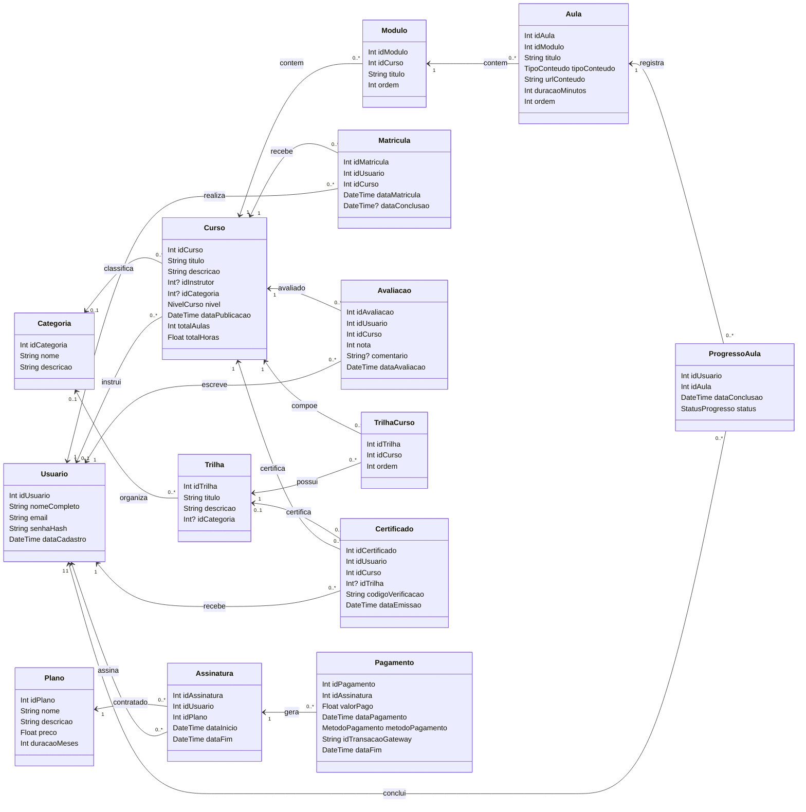

# Diagrama de classes - LAB03

Este diagrama foi montado a partir de `prisma/schema.prisma` e segue o modelo de dados do LAB03 - Plataforma de Cursos Online.

## Tabelas no banco

O Prisma usa modelos em singular no client, mas as tabelas fisicas foram mapeadas com `@@map` para os nomes do LAB03:

- `Usuarios`
- `Categorias`
- `Cursos`
- `Modulos`
- `Aulas`
- `Matriculas`
- `Progresso_Aulas`
- `Avaliacoes`
- `Trilhas`
- `Trilhas_Cursos`
- `Certificados`
- `Planos`
- `Assinaturas`
- `Pagamentos`
