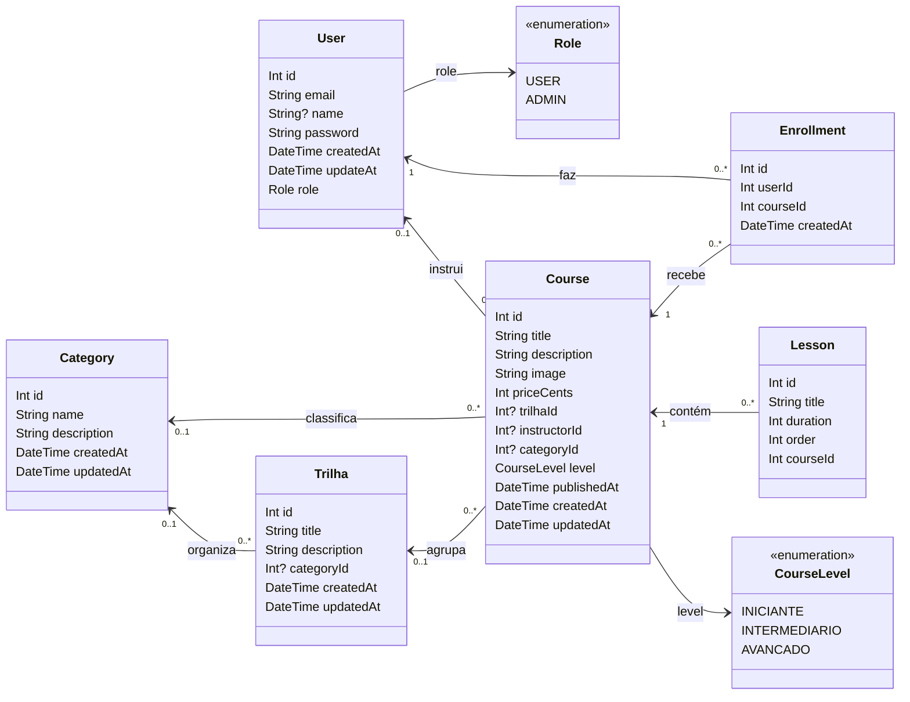

# Diagrama de classes e conferência com o LAB03

Este documento tem duas partes:

1. O diagrama do schema **atual** da API (`api/prisma/schema.prisma`).
2. A conferência campo a campo com a seção "Modelo de Dados" do LAB03
   (`docs/Plataforma de cursos.pdf`), dizendo qual campo do projeto cobre cada
   campo do PDF e em que etapa entra o que ainda falta.

Atualizado na etapa 10 (30/09/2026). As etapas 10 a 14 atualizam este arquivo a
cada mudança no schema.

## 1. Schema atual

Os nomes seguem o padrão em inglês do projeto. O `User` é o model do PDF
"CRUD - NestJS" (inclusive o `updateAt`, sem o "d"), mais o `role`.

Restrições que valem hoje:

- `User.email` é único.
- `Enrollment` é único por `(userId, courseId)`: o banco impede matrícula
  duplicada.
- `Lesson` é única por `(courseId, order)`; `duration` é em minutos.
- Apagar um curso apaga as aulas e as matrículas dele; apagar uma trilha só deixa
  os cursos dela sem trilha.
- `Category.name` é único. Apagar uma categoria só deixa os cursos e as trilhas
  dela sem categoria; apagar um usuário instrutor só deixa os cursos dele sem
  instrutor.
- `Course.level` é `INICIANTE` por padrão; `Course.publishedAt` é a data de
  agora, se não for informada.

## 2. Conferência com o LAB03

O PDF numera 13 tabelas, mas lista 14 (Pagamentos também aparece como "13").
Situação: **existe** = já está no schema atual; **etapa N** = entra na etapa N do
plano (ver `PLANO.md`).

Exceções combinadas, por serem erros de digitação do PDF: o `DataFim` repetido
em Assinaturas vira uma coluna só; `ValorPago` é um valor em `Decimal`, não FK.
`Preco` e `ValorPago` são `Decimal`.

### Usuarios → `User`

| LAB03 | Projeto | Situação |
| --- | --- | --- |
| ID_Usuario (PK) | `User.id` | existe |
| NomeCompleto | `User.name` | existe |
| Email (Unique) | `User.email` (`@unique`) | existe |
| SenhaHash | `User.password` (hash bcrypt) | existe |
| DataCadastro | `User.createdAt` | existe |

### Categorias → `Category`

| LAB03 | Projeto | Situação |
| --- | --- | --- |
| ID_Categoria (PK) | `Category.id` | existe |
| Nome (Unique) | `Category.name` (`@unique`) | existe |
| Descricao | `Category.description` | existe |

### Cursos → `Course`

| LAB03 | Projeto | Situação |
| --- | --- | --- |
| ID_Curso (PK) | `Course.id` | existe |
| Titulo | `Course.title` | existe |
| Descricao | `Course.description` | existe |
| ID_Instrutor (FK Usuarios) | `Course.instructorId` → `User` (opcional) | existe |
| ID_Categoria (FK Categorias) | `Course.categoryId` → `Category` | existe |
| Nivel | `Course.level` (`INICIANTE`, `INTERMEDIARIO`, `AVANCADO`) | existe |
| DataPublicacao | `Course.publishedAt` | existe |
| TotalAulas | `Course.totalLessons` (gravado, recalculado pela API) | etapa 11 |
| TotalHoras | `Course.totalHours` (`Decimal`, 2 casas, recalculado pela API) | etapa 11 |

A mais no projeto: `image`, `priceCents` (preço só do ADMIN), `createdAt` e
`updatedAt`. O `trilhaId` sai na etapa 12 (trilha N:N).

### Modulos → `Module`

| LAB03 | Projeto | Situação |
| --- | --- | --- |
| ID_Modulo (PK) | `Module.id` | etapa 11 |
| ID_Curso (FK Cursos) | `Module.courseId` | etapa 11 |
| Titulo | `Module.title` | etapa 11 |
| Ordem | `Module.order` (único por curso) | etapa 11 |

### Aulas → `Lesson`

| LAB03 | Projeto | Situação |
| --- | --- | --- |
| ID_Aula (PK) | `Lesson.id` | existe |
| ID_Modulo (FK Modulos) | `Lesson.moduleId` (substitui `courseId`) | etapa 11 |
| Titulo | `Lesson.title` | existe |
| TipoConteudo | `Lesson.contentType` (`VIDEO`, `TEXTO`, `QUIZ`) | etapa 11 |
| URL_Conteudo | `Lesson.contentUrl` (opcional) | etapa 11 |
| DuracaoMinutos | `Lesson.duration` (minutos) | existe |
| Ordem | `Lesson.order` (passa a ser único por módulo) | existe |

### Matriculas → `Enrollment`

| LAB03 | Projeto | Situação |
| --- | --- | --- |
| ID_Matricula (PK) | `Enrollment.id` | existe |
| ID_Usuario (FK Usuarios) | `Enrollment.userId` | existe |
| ID_Curso (FK Cursos) | `Enrollment.courseId` | existe |
| DataMatricula | `Enrollment.createdAt` | existe |
| DataConclusao (nulável) | `Enrollment.completedAt` (opcional) | etapa 14 |

### Progresso_Aulas → `LessonProgress`

| LAB03 | Projeto | Situação |
| --- | --- | --- |
| ID_Usuario (PK, FK Usuarios) | `LessonProgress.userId` (PK composta) | etapa 14 |
| ID_Aula (PK, FK Aulas) | `LessonProgress.lessonId` (PK composta) | etapa 14 |
| DataConclusao | `LessonProgress.completedAt` | etapa 14 |
| Status | `LessonProgress.status` (`EM_ANDAMENTO`, `CONCLUIDO`) | etapa 14 |

### Avaliacoes → `Review`

| LAB03 | Projeto | Situação |
| --- | --- | --- |
| ID_Avaliacao (PK) | `Review.id` | etapa 14 |
| ID_Usuario (FK Usuarios) | `Review.userId` | etapa 14 |
| ID_Curso (FK Cursos) | `Review.courseId` | etapa 14 |
| Nota (1 a 5) | `Review.rating` | etapa 14 |
| Comentario (nulável) | `Review.comment` (opcional) | etapa 14 |
| DataAvaliacao | `Review.createdAt` | etapa 14 |

### Trilhas → `Trilha`

| LAB03 | Projeto | Situação |
| --- | --- | --- |
| ID_Trilha (PK) | `Trilha.id` | existe |
| Titulo | `Trilha.title` | existe |
| Descricao | `Trilha.description` | existe |
| ID_Categoria (FK Categorias) | `Trilha.categoryId` → `Category` | existe |

### Trilhas_Cursos → `TrilhaCourse`

| LAB03 | Projeto | Situação |
| --- | --- | --- |
| ID_Trilha (PK, FK Trilhas) | `TrilhaCourse.trilhaId` (PK composta) | etapa 12 |
| ID_Curso (PK, FK Cursos) | `TrilhaCourse.courseId` (PK composta) | etapa 12 |
| Ordem | `TrilhaCourse.order` | etapa 12 |

### Certificados → `Certificate`

| LAB03 | Projeto | Situação |
| --- | --- | --- |
| ID_Certificado (PK) | `Certificate.id` | etapa 14 |
| ID_Usuario (FK Usuarios) | `Certificate.userId` | etapa 14 |
| ID_Curso (FK Cursos) | `Certificate.courseId` (obrigatório) | etapa 14 |
| ID_Trilha (FK Trilhas, Null) | `Certificate.trilhaId` (opcional) | etapa 14 |
| CodigoVerificacao (Unique) | `Certificate.verificationCode` (`@unique`) | etapa 14 |
| DataEmissao | `Certificate.issuedAt` | etapa 14 |

### Planos → `Plan`

| LAB03 | Projeto | Situação |
| --- | --- | --- |
| ID_Plano (PK) | `Plan.id` | etapa 14 |
| Nome (not Null) | `Plan.name` | etapa 14 |
| Descricao | `Plan.description` (opcional) | etapa 14 |
| Preco (not Null) | `Plan.price` (`Decimal`) | etapa 14 |
| DuracaoMeses (not Null) | `Plan.durationMonths` | etapa 14 |

### Assinaturas → `Subscription`

| LAB03 | Projeto | Situação |
| --- | --- | --- |
| ID_Assinatura (PK) | `Subscription.id` | etapa 14 |
| ID_Usuario (FK Usuarios, not Null) | `Subscription.userId` | etapa 14 |
| ID_Plano (FK Planos, not Null) | `Subscription.planId` | etapa 14 |
| DataInicio (not Null) | `Subscription.startsAt` | etapa 14 |
| DataFim (not Null, listado duas vezes) | `Subscription.endsAt` (uma coluna) | etapa 14 |

### Pagamentos → `Payment`

| LAB03 | Projeto | Situação |
| --- | --- | --- |
| ID_Pagamento (PK) | `Payment.id` | etapa 14 |
| ID_Assinatura (FK Assinaturas, not Null) | `Payment.subscriptionId` | etapa 14 |
| ValorPago (not Null) | `Payment.amount` (`Decimal`; no PDF aparece como FK, erro de digitação) | etapa 14 |
| DataPagamento (not Null) | `Payment.paidAt` | etapa 14 |
| MetodoPagamento (not Null) | `Payment.method` (`CARTAO_CREDITO`, `CARTAO_DEBITO`, `PIX`, `BOLETO`) | etapa 14 |
| Id_Transacao_Gateway (not Null) | `Payment.gatewayTransactionId` | etapa 14 |
| DataFim (not Null) | `Payment.endsAt` (fim do período pago) | etapa 14 |

### Resumo

| Situação | Campos |
| --- | --- |
| existe | 27 |
| etapa 11 | 9 |
| etapa 12 | 3 |
| etapa 14 | 34 |
| **total** | **73** |
